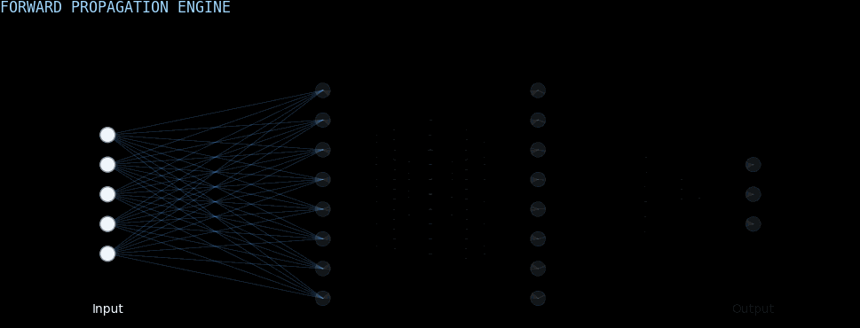

# Hi there! I'm Nehal 👋
### 🤖 Aspiring AI Engineer | Deep Learning Enthusiast | Thumbnail Designer

<!-- The Animated NN Header you created -->

---

*"Bridging the gap between mathematical complexity and functional software design."*

[X](https://x.com/NyhalRaza) • [LinkedIn](https://www.linkedin.com/in/nyhal-raza) • [Email](mailto:nyhal.raza@gmail.com)

## 🧬 About Me
I am a Computer Science student with specialization in AI dedicated to building intelligent systems that solve real-world problems. With a background in **Computer Vision** and **Deep Learning**, I focus on developing efficient models and integrating them into robust software architectures. I also have a strong eye for **UI/UX and design**, ensuring that technical solutions are as intuitive as they are powerful.

- 🔭 **Current Focus:** Deepening my expertise in Computer Vision and generative models.
- 🛠 **Working on:** [DeepGuard AI](https://github.com/your-username/careerpilot) - An AI-driven deepfake detection platform.
- 🌱 **Learning:** GenAI.
- ⚡ **Fun Fact:** When I'm not coding, I'm likely analyzing game mechanics or hitting a new PR in the gym.

---

## 🛠 Tech Stack

### 🧠 Artificial Intelligence & Data Science

### 💻 Software Development

### 🌐 Web & Design

---

## 📊 GitHub Stats

<!-- Main Stats Card (Simplified) -->

 

<!-- Top Languages Card (Simplified) -->

 

  

---

## 🛠 Tools & Environments
`PyCharm` | `VS Code` | `Visual Studio` | `Eclipse` | `SSMS` | `Postman` | `Anaconda` | `Google Colab` | `Slack`

  

